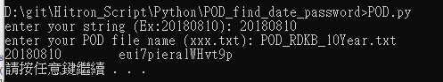
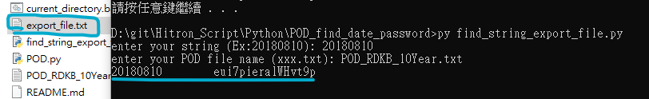

# About the Script
* The purpose of this test is to find certain string in a text file. 
* POD means password of day, which is everyday have a unique password
* So inorder to get specfic password, just have to enter the correct date format
* This is a script that will find string inside a text file . 

# Decription of the python file
* POD.py => get eh specfic password
* find_string_export_file.py ==> will find specfic password and export out into a file 

# Procedure 
Prerequisite: Please provide your own pod text file
```sh
1. Put your text file in the directory
2. run the script
3. script will ask you to enter your text file and date you wants to find
```

## How to work with the script:
1) POD.py
```
#POD.py
enter your string (Ex:20180810): 20180810
enter your POD file name (xxx.txt): POD_RDKB_10Year.txt
20180810        eui7pieralWHvt9p
```


2 find_string_export_file.py
```
#find_string_export_file.py
enter your string (Ex:20180810): 20180810
enter your POD file name (xxx.txt): POD_RDKB_10Year.txt
```

