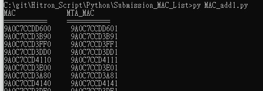
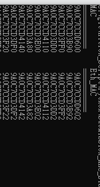
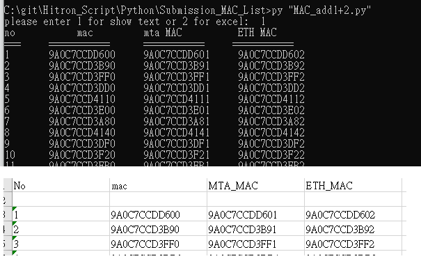

# About the Script
* This script is use for sending submission mac list adding the last digit of mac address to 1. 
* MTA Mac address: DUT last digit  +1
* Ethernet Mac address : DUT last digit  +2

## What is the purpose for this

* Many Product have MAC Address, but some product will have more than one interface, and which will provide another MAC address. 
* Most time the MAC address of different interface will add one or two to it. Example: router: 1234567890, and Mta interface: 1234567891. 
* Most of mac will be in HEX, so if we have many MAC it will be difficult to add manual. 
* My script will solve this problem:
  * don't have to calculate the last digit or hex decimal
  * You can copy the excel file  I convert and paste to final report. 

## Getting Started

* paste your mac list into data.txt file 
* run the script (recommend use MAC_add1+2.py), it support export txt and excel method
* 
## How to use it
1) Enter your mac address into data.txt
2) run  MAC_add1.py to add last digit to 1 . (Ex: 1234567890 =>1234567891) to a new file called data_out.txt 

# Description of the python file
* MAC_add1.py ==>add Mac last digit +1 for MTA product 
* MAC_add2.py ==>add Mac last digit +2 for NO MTA product 
* MAC_add1+2.py ==>add Mac last digit +1 +2 ALL product (either with or without MTA)

## How to work with the script:

1. **MAC_add1+2.py**
* output: 
	```
      MAC             MTA_MAC
       ===========     ===========
       9A0C7CCDD600     9A0C7CCDD601
       9A0C7CCD3B90     9A0C7CCD3B91	
  ```
	 
2.  **MAC_add1.py**
* output: 
	```
      MAC             Eth_MAC
       ===========     ===========
       9A0C7CCDD600     9A0C7CCDD602
       9A0C7CCD3B90     9A0C7CCD3B92	
  ```
	 
3. **MAC_add2.py**
* output: 
     ```
        please enter 1 for show text or 2 for excel:  1
        no           mac         mta MAC          ETH MAC
        ===     ===========      ===========     ===========
        1       9A0C7CCDD600     9A0C7CCDD601     9A0C7CCDD602
        2       9A0C7CCD3B90     9A0C7CCD3B91     9A0C7CCD3B92
        3       9A0C7CCD3FF0     9A0C7CCD3FF1     9A0C7CCD3FF2
        4       9A0C7CCD3DD0     9A0C7CCD3DD1     9A0C7CCD3DD2
     ```
     

## Update

* update 2021:  in this code design two function export to text file and excel file
  * it will first read the data.text, and add MAC last digit to 1 and 2, and export to a new file.
  * If you enter 1 it will export to text file, and read the text file
  * If you enter 2 it will export to text file, and convert to excel file 
  *  File description: 

		| print_all_line.py    |   read from text file    |
		| -------------------- | ---- |
		| mac_excel_convert.py |  convert text file to excel file     |

# Resource

Python2.7: adding hex to 1 for 10 digit will become L , in python3 fix this issue

```
f = "0x12345678910"
value = int(f,16)
value +=1
print (hex(value))
#0x12345678911L
```
solution: 
```
hex(value).rstrip("L").lstrip("0x") or "0"
#'12345678911'
#or 
hex(value).rstrip("L")
#'12345678911'
```

* Link for reference: 
https://stackoverflow.com/questions/23396711/how-to-do-a-hexadecimal-increment
**16 base remove L in end and 0x in beginner, L is long:**
https://stackoverflow.com/questions/10218164/how-to-convert-an-integer-to-hexadecimal-without-the-extra-0x-leading-and-l
**How to use hex() without 0x in Python?**
https://stackoverflow.com/questions/16414559/how-to-use-hex-without-0x-in-python