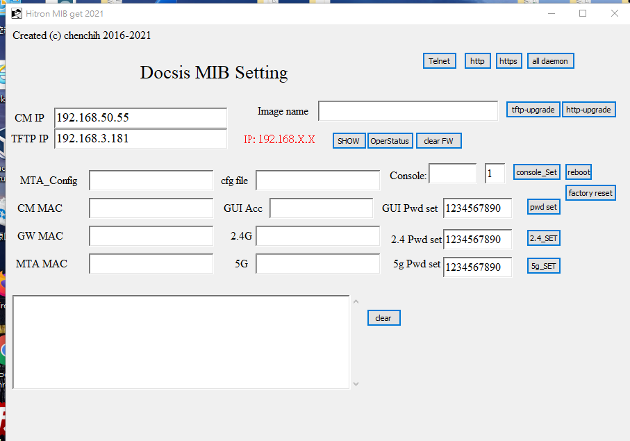
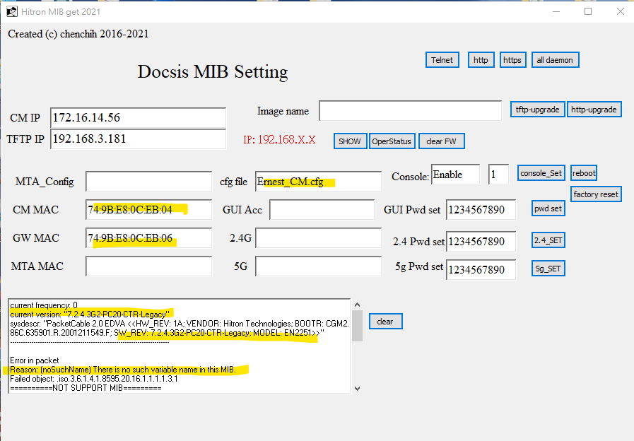
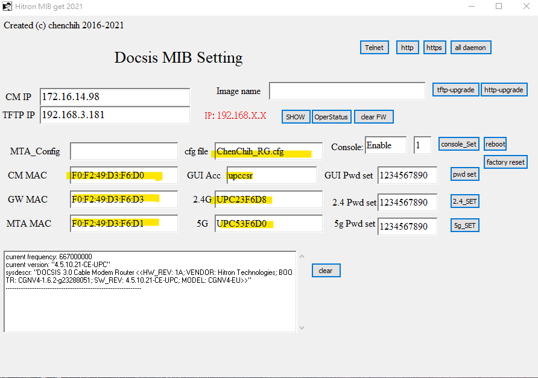

# Intro
*	This is a script used in tcl, which you do not have to used open snmp browser, ot find the oid, I already apply it in my script. 
*	You just have to enter your DUT IP address and it will just get the value using snmp get or set. 
*	I believe it will be more efficiently and productivity; speed up your time. 
*	You don’t have to memories or find which OID. You don’t even have to open mib browser, or find command on how to used it.

# Installation
Install TCL ActiveTcl8.4.X version, else unable to run

```sh
extract tcl-snmptools-1.0.tar
copy tcl-snmptools-1.0 to  tcl\bin
```
# How to start 
- Open freq_GUI_LGI_Fw_Upgrade.tcl
- Enter your DUT's IP address
- Press show, will get all information: sw version, MAC
# Feature: 
## Basic Feature
- show: get all related infomation (SW version, MAC address, configure file)
- PWD set: set your GUI password (only LGI customer will needed)
- 2.4G and 5G set: set 2.4G and 5G wifi password
- rebot: reboot DUT
- Factory reset: Factory reset
- console set: enable console, if show 0 mean console disable
- telnet, ssh https, http is to enable either one. All daemon:enable all http, https, telnet, ssh 
## Upgrade FW
- Image Name: put your fw name
- tftp-upgrade: upgrade from tftp
- http-upgrade: upgrade from http server
- clear FW: clear Image name if you type wrong
- How to upgrade:

```sh
1. Put your DUT Ip address 
2. Put your tftp or http server 
3. Put your fw image name
4. press tftp or http to upgrade
```

# Default setting:


# Bridge Product Setting:


# Router Product Setting:


# conclusion
Any question if let me know, thanks. 
I have been using this script for most of my time. There might be some problem or bug on it, but overall I think it can be helpful of most of the task
